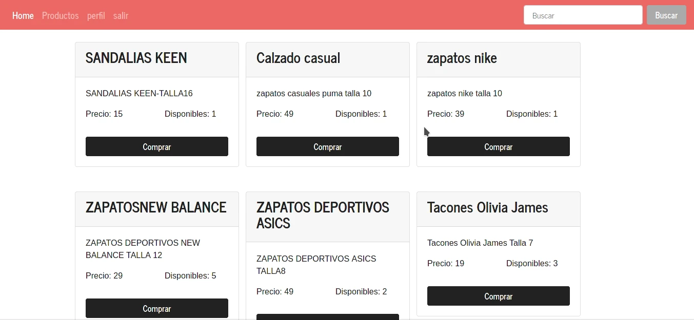

# Genesis

## Descripción
Este es un proyecto escolar que consiste en un e-comerce desarrollado con express nodejs mysql y stripe js



## Instalación 
``` 
git clone https://github.com/HECTORalvarado/Genesis.git 
cd Genesis
npm install
npm run dev
```
en la carpeta database encontraras el script para crear la base de datos

## Configuraciones
Abre el archivo **productos.hbs** en 
```
cd src/views/products
```
y luego cambia esta parte por tu llave publica de stripe
``` html
<script data-key="pk_test_51HfVBhHeZ8a6bHaCA6q50LNF7Rl3M8g217DLB1igbHip7mQgJ4HxnW99U4RB2KPc62If1NKAiY7V2Ys69YsJxrmi00MbB1f0Zw"> </script>
```
 Y en ` src/routes/checkout.js ` linea numero 4 pon tu llave privada de stripe

## Tutorial
Este proyecto se ha basado en este
[tutorial de fazt](https://www.youtube.com/watch?v=o9eij8FEvuA)

## A solventar
- [ ] No se muestran las imagenes de los productos